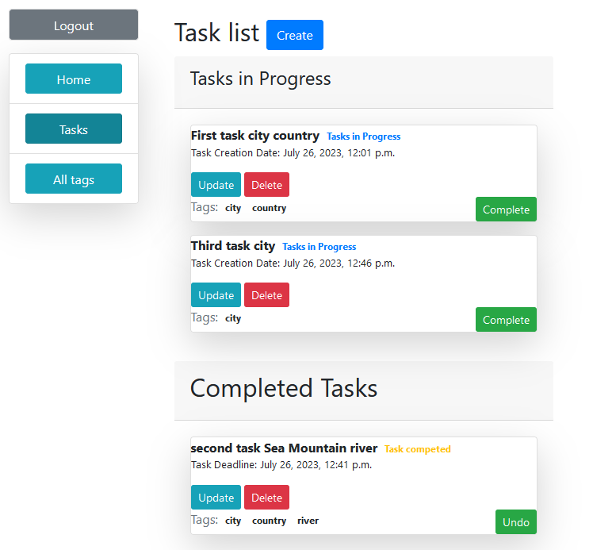
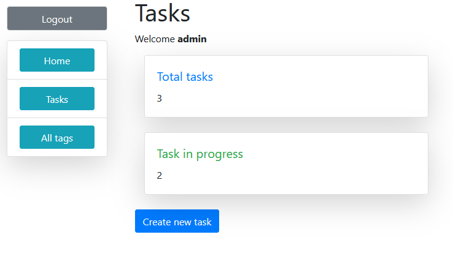
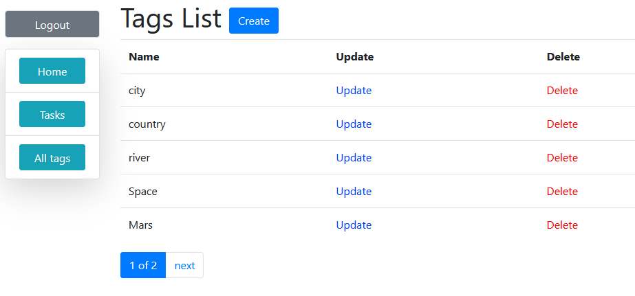

# TODO LIST

​
- [Description](#description)
- [Application functional](#functional)
- [Technologies](#technologies)
- [Website Interface](#Demo)
​
## Description
​
Todo list. Django practice project
​
## Application functional
* Login/Register
* View, create, delete tasks
* View, create, delete tags
​
## Technologies
​
- [Django Official Documentation](https://docs.djangoproject.com/)
Django is a high-level Python Web framework. In this project, it's used to create the whole website including frontend side. This service builds the Django application and exposes it on port 8000.
​
​
## Demo

